# DELICIOUS-Sandwiches

Welcome I'll like to introduce my GRAND DELI Sandwich Application  where you can order your sandwich from home or anywhere in seconds!!

This Sandwich App give you the ability to order many sandwiches and give a variety of sizes and Toppings.

The GRAND DELI Sandwich application keeps track of different orders and allows the customer to see their total cost before confirming their order to avoid any confusion or mistakes. It also provides the customer with a digital receipt, either on their mobile device or at the restaurant by the cashier.

##  Thinking Process

In my thinking process I had an outline of the different classes I want. With only one abstract class called ordersize and a interface of cashier that has the price to implement in all the classes : Topping, Sanwich, Drink, Chips. I only had one topping class where the Sandwitch has a topping arrayList. However I notice that I was missing somethings and created a second outline. 

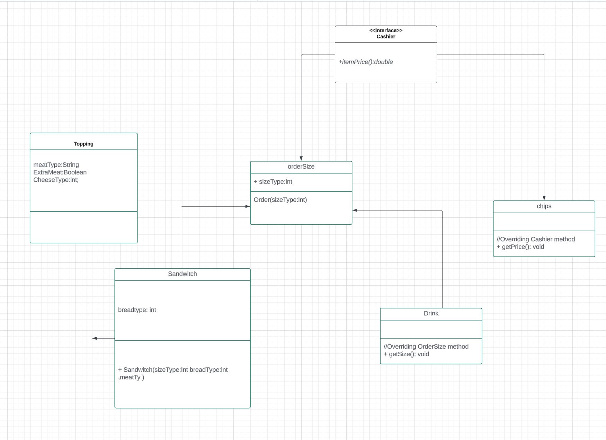

In my new Diagram I implement more class a Regular and Cost Topping that can extends from the topping abstract class. However the part that I was having trouble, once I had everything I was having toruble getting all the prices from the different class in one arrayList. I was able to find a solution by switching the price and size. Price to the sizeOrder and size to the product price.  

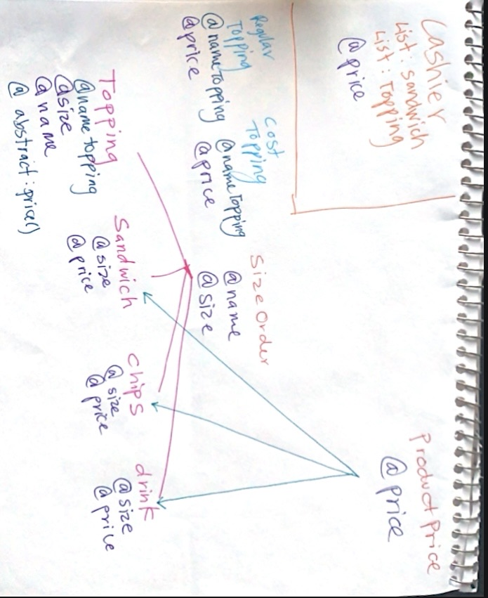

## DEMO

Lets Order a sandwich
- Enter 1

Once entering 1 
It will prompt for the customer name to keep track of the person order and who it is. 

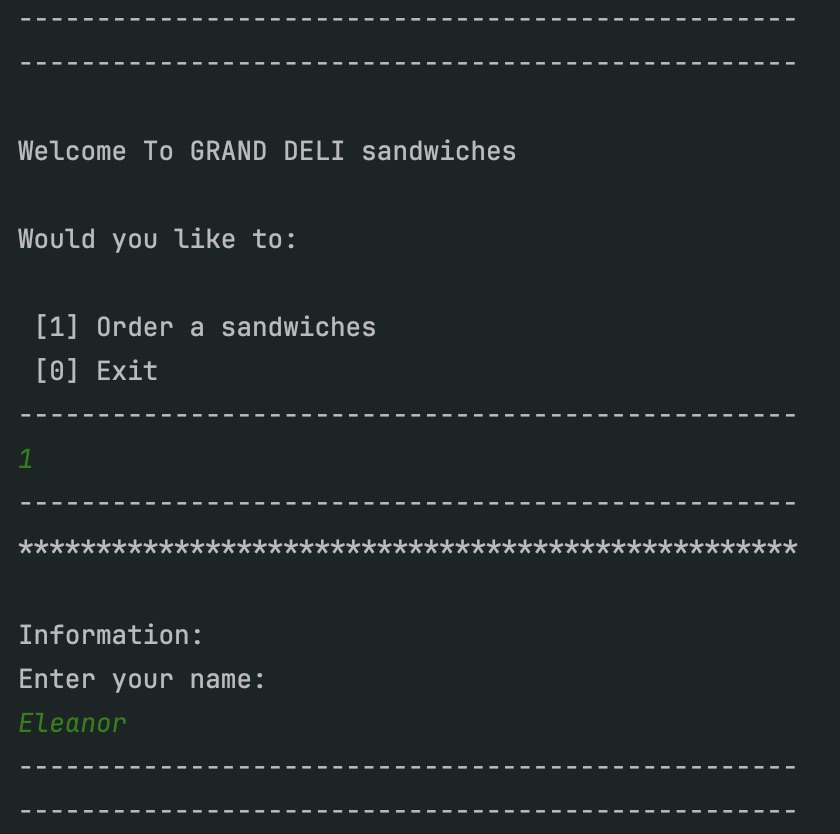

View GRAND DELI Meun options 
- Enter 1

Also allows you to create a sandwich 

SELECT a sandwich Size
- Enter 1 (For a Small 4'')

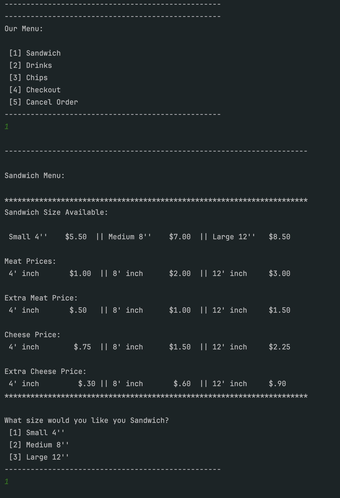

- Enter 1 (For White Bread)
- Enter 5 (For Chicken)
- Enter 1 (For Extra Meat)
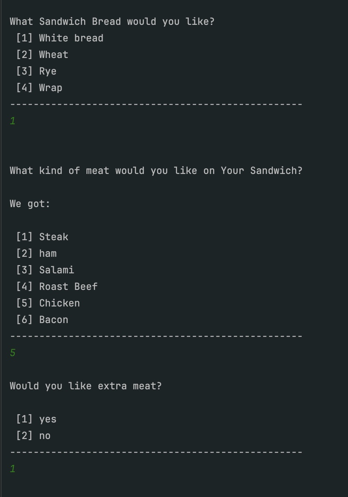

- More toppings
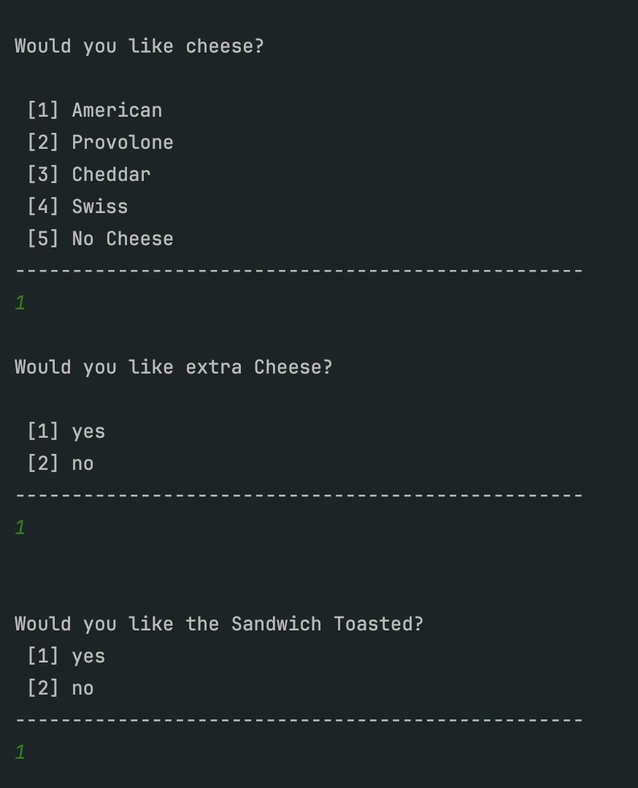

- selecting healthy Topping
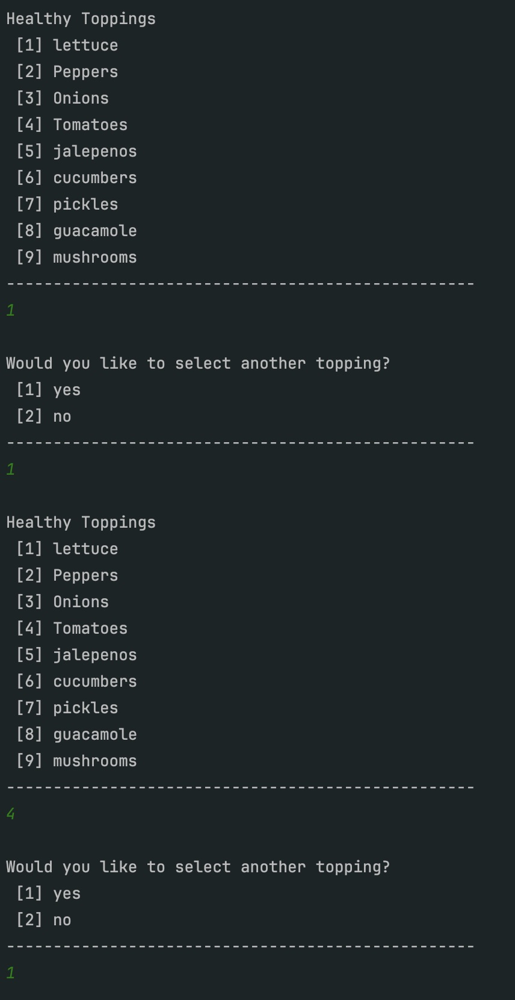

- More healthy Topping 
- Prompting Elenor for Sauce Topping (Mayo)
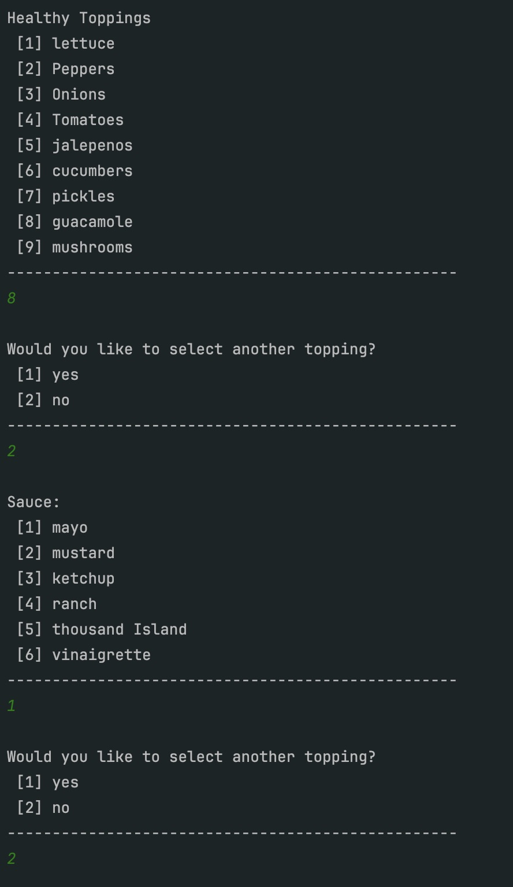

Sauce Toppings
- Return to menu by pressing [enter] to get another order
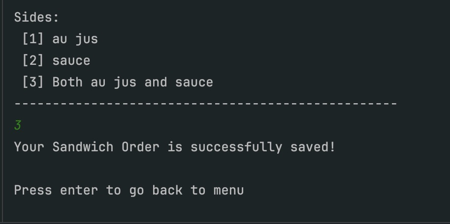

Elenor Orders a Drink to add into her Order:
- Enter 1 (For a small )
- Enter 1 (For a Coke )
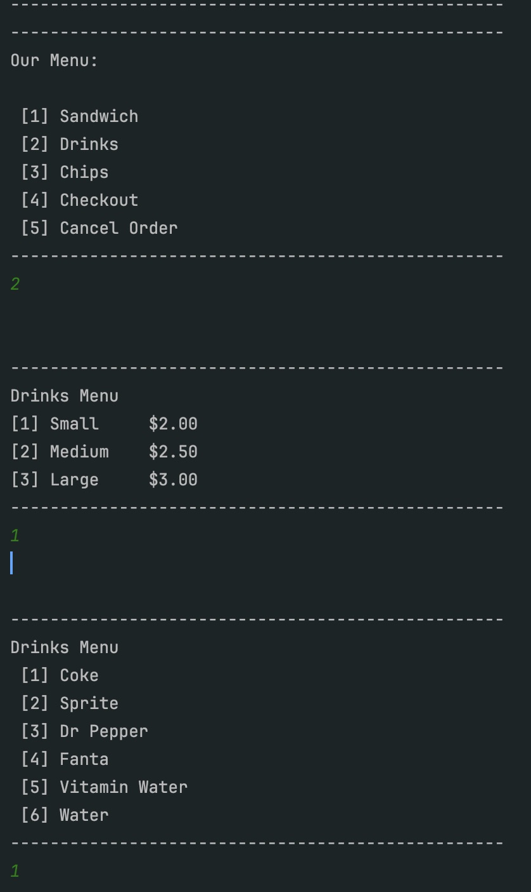

Elenor wants chips : 
- Enter 3 (For chips)
- Enter 4 (For Lays Baked chips)
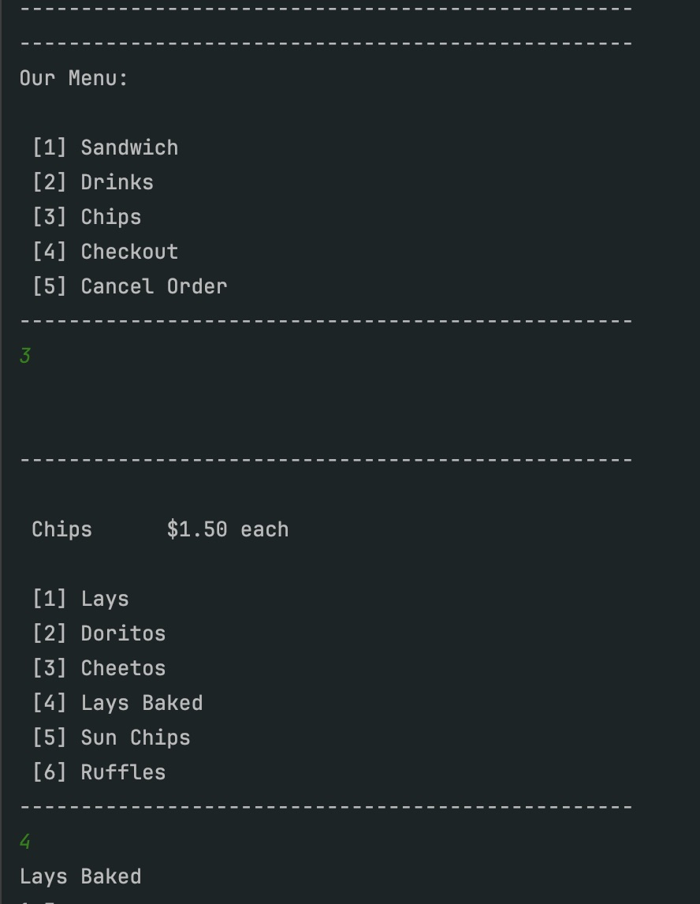

Elenor want to checkOut
- Enter 4 (TO complete and see total cost of the many items)

Elenor has the ability to see her Order Summary 

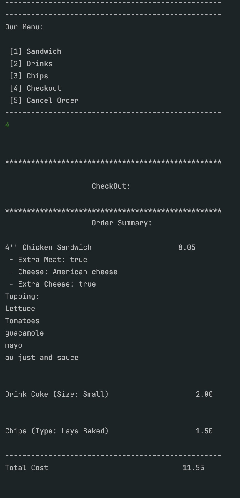

GRAND DELI sandwich allows Elenor to confirm her order or Cancel it
- Enter 1 (To confirm)
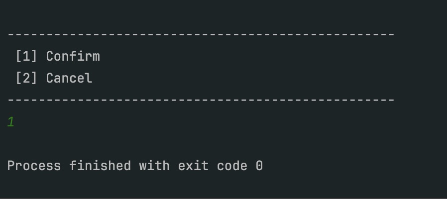

- Receipts
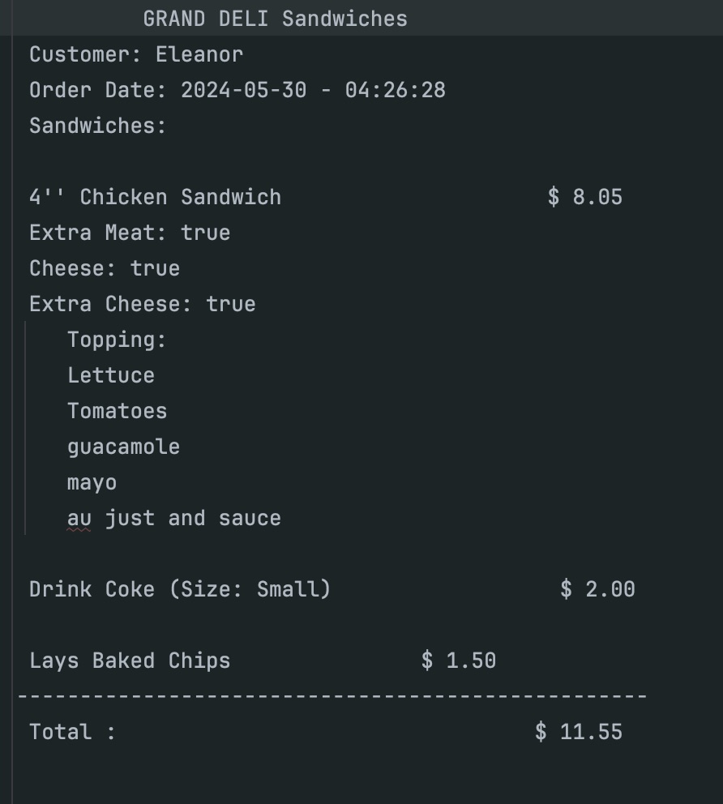

## Code

My Topping class was the part where I was having challenges because I did not know how to set up my Topping class so it would not conflict with my ExtraCostTopping. In my Topping abstract class, I had my type and size. When I tried working with it in my application class, I did not want my size, so I removed it. Then, I got the Topping class and ExtraCostTopping to work and get the information I wanted. I also did not want the size type in my regular Topping because it did not matter what size it was, as it was included and did not have a cost based on the sandwich sizes.

public abstract class Topping
{
    String type;

    public Topping(String type)
    {
        this.type = type;
    }
}

public class RegularTopping extends Topping
{

    public RegularTopping(String type) {
        super(type);
    }
    
}

public class ExtraCostTopping extends Topping implements ToppingSize
{
    private int sizeType;
    private String meat;
    private boolean extraMeat;
    private String cheese;
    private boolean extraCheese;;

    public ExtraCostTopping(String type, int sizeType, String meat, boolean extraMeat, String cheese, boolean extraCheese) {
        super(type);
        this.sizeType = sizeType;
        this.meat = meat;
        this.extraMeat = extraMeat;
        this.cheese = cheese;
        this.extraCheese = extraCheese;;
    }
}

